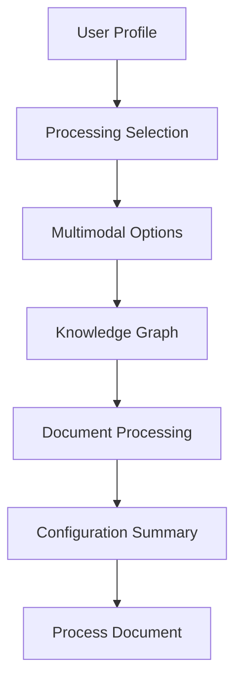

# Enhanced Multimodal Processing Test

## Implementation Summary

The AI assistant now includes comprehensive questions for:
1. **Multimodal Processing**: Images, audio, OCR, visual analysis
2. **Knowledge Graph**: Entity extraction with customizable entity types
3. **Document Processing (IDP)**: Tables, forms, metadata, classification

## Test Steps

1. **Start the development server**
   ```bash
   npm run dev
   ```

2. **Upload a document**
   - Navigate to http://localhost:3000
   - Upload a document with mixed content (text, images, tables)

3. **Complete the AI Assistant Conversation Flow**

   The conversation now follows this enhanced path:
   
   a. **User Profiling**
      - Role selection (Sales, Service, Marketing, etc.)
      - Department selection
      - Experience level
      - Primary goal
      - Urgency
      - Detail level
   
   b. **Processing Method Selection**
      - System recommends methods based on your profile
      - Select the recommended processing approach
   
   c. **Multimodal Questions**
      - "Does your document contain images?" → Yes/No
      - "Are there any audio files?" → Yes/No
      - "Do you have scanned documents needing OCR?" → Yes/No
      - "Would you like visual content analysis?" → Yes/No
      - "What type of image processing?" → Caption/OCR/Both/None
   
   d. **Knowledge Graph Questions**
      - "Extract entities and relationships?" → Yes (all)/Yes (specific)/No
      - If specific: "Which entities?" → People & Orgs/Products & Services/Locations & Events/All
   
   e. **Document Processing Questions**
      - "What type of data extraction?" → Structured/Metadata/Full/None

4. **Verify Configuration Summary**
   
   After answering all questions, you'll see a comprehensive summary like:
   ```
   📚 Document Search (RAG)
   - Multimodal Processing: Audio Transcription, OCR, Image Captioning, Visual Analysis
   
   🔗 Knowledge Graph
   - Entity Types: person, organization
   - Relationship Mapping: Enabled
   
   📄 Document Processing (IDP)
   - Extracting: Tables, Form Fields, Metadata, Classification
   ```

5. **Check Manual Configuration Sync**
   
   The left panel (Manual Configuration) should automatically reflect:
   - RAG enabled with selected multimodal options
   - KG enabled with chosen entity types
   - IDP enabled with selected extraction types

6. **Process Document**
   - Click "Process Document" button
   - Processing starts with all selected options
   - Monitor progress in the processing panel

## What's New

1. **Comprehensive Image Processing Questions**
   - Explicit question about image availability
   - Choice between caption generation and OCR
   - Separate visual analysis option

2. **Knowledge Graph Configuration**
   - Enable/disable KG processing
   - Select specific entity types or all
   - Automatic relationship mapping

3. **Document Processing Options**
   - Structured data extraction (tables, forms)
   - Metadata and classification
   - Full document processing option

4. **Enhanced Configuration Summary**
   - Clear visualization of all selected options
   - Emoji icons for each processing type
   - Detailed feature listing

## Configuration Flow



## Expected Behavior

1. **AI Assistant Questions**
   - All questions appear in logical order
   - Each answer influences subsequent questions
   - Configuration builds progressively

2. **Configuration Sync**
   - Manual config updates in real-time
   - All multimodal options properly reflected
   - KG and IDP settings synchronized

3. **Processing**
   - Document processes with ALL selected features
   - Multimodal processing active when selected
   - KG extraction uses chosen entity types
   - IDP extracts selected data types

## Debugging

If issues occur:
1. Check browser console for errors
2. Verify all action handlers are registered
3. Confirm state updates in React DevTools
4. Check network tab for API calls

## Code Architecture

The implementation spans:
- `/services/ConversationManager.ts` - Extended conversation flow
- `/hooks/useConversation.ts` - Added new action handlers
- `/components/UnifiedDashboard.tsx` - Enhanced config sync
- `/components/ConversationalUI.tsx` - UI for conversation

All components work together to provide a comprehensive configuration experience through natural conversation.